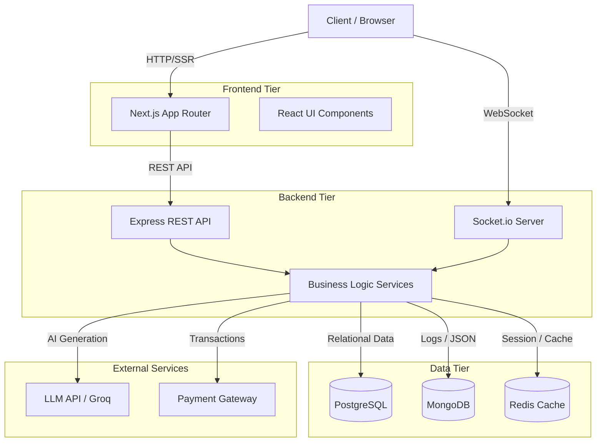

# High-Level Design (HLD) - InterviewFlow

## 1. System Overview
InterviewFlow is an AI-powered mock interview platform designed to help developers practice technical interviews. The system architecture is built around a modern, scalable, and highly responsive stack featuring Server-Side Rendering (SSR) for initial loads and WebSockets for real-time live interview sessions.

## 2. Architecture Diagram

## 3. Core Components

### 3.1 Frontend (Next.js)
- **Framework**: Next.js (App Router)
- **Role**: Serves the user interface, manages routing, handles server-side data fetching for SEO and fast initial loads, and maintains the WebSocket connection during live interviews.
- **Styling**: Tailwind CSS with a strict, minimalist design system.

### 3.2 Backend (Express.js)
- **Framework**: Node.js + Express
- **Role**: Acts as the central API gateway and business logic processor. Handles user authentication, interview management, caching strategies, and integration with third-party APIs.

### 3.3 Real-Time Server (Socket.io)
- **Role**: Manages stateful, bi-directional communication during live mock interviews.
- **Features**: Broadcasts questions sequentially, receives answers, tracks progress, and emits completion events.

### 3.4 Data Tier
- **PostgreSQL (via Prisma)**: Primary source of truth. Stores structured, relational data such as Users, Interviews, and Payments.
- **MongoDB (via Mongoose)**: Stores unstructured or flexible document data, such as detailed system logs or complex AI prompt/response metadata.
- **Redis**: Functions as an ultra-fast in-memory cache for API responses (e.g., fetching user interviews) and manages transient live-session state.

## 4. Key Workflows

1. **Authentication**: Users log in via the REST API. The backend returns an `HttpOnly` cookie for secure SSR data fetching and a JWT payload (in localStorage) exclusively used to authenticate the WebSocket handshake.
2. **Interview Generation**: The user selects a role and difficulty. The backend requests the LLM API to generate a set of deterministic questions, caches the response in Redis, and stores the interview metadata in PostgreSQL.
3. **Live Session**: The client upgrades to a WebSocket connection. The backend streams questions one-by-one. The user submits answers, and the backend tracks progress in Redis until the session concludes.
